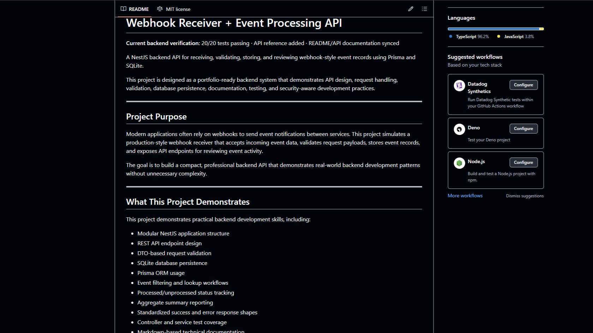
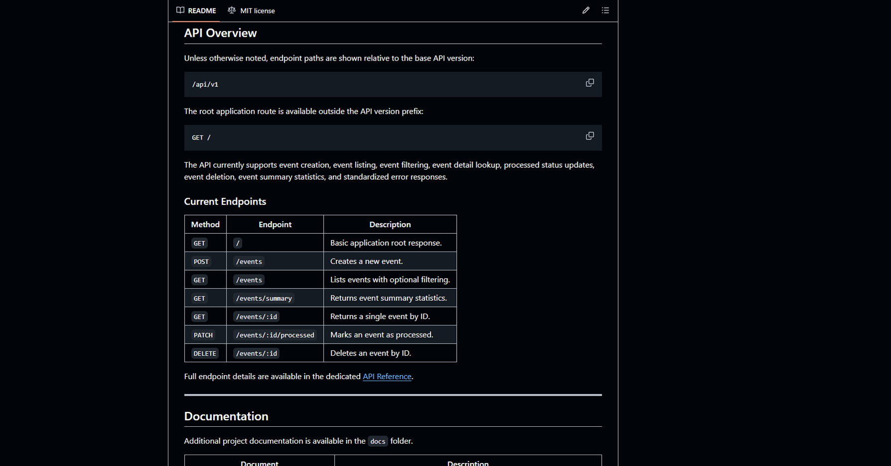
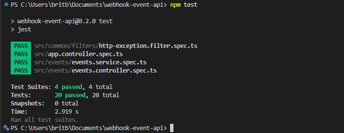
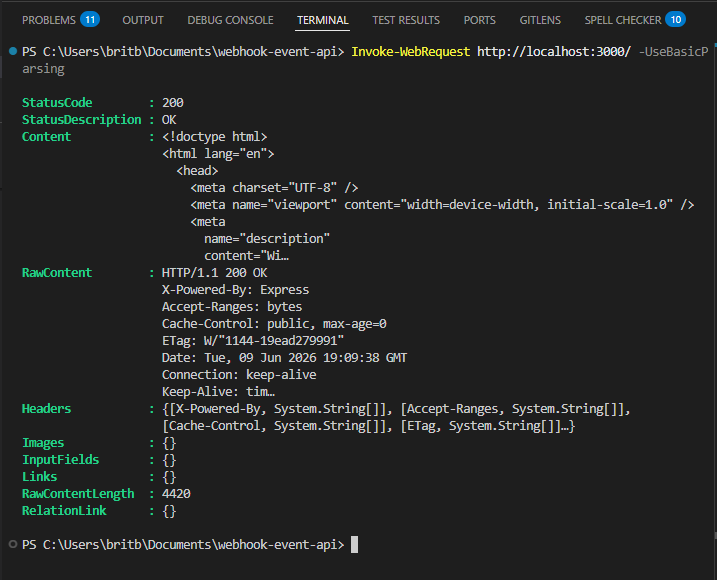
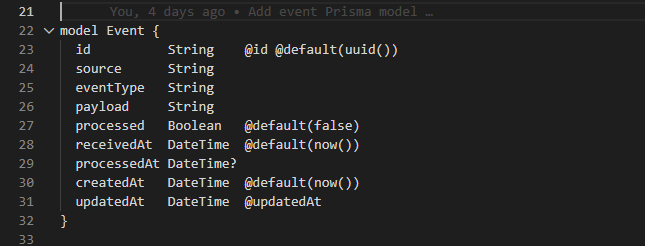

# Webhook Receiver and Event Processing API

A portfolio documentation snapshot for a NestJS backend that receives,
validates, stores, filters, and processes webhook-style event records with
Prisma and SQLite.

> This folder contains the polished documentation and screenshots from the
> project checkpoint. It does not include the runnable application source.

## Project Overview

Modern applications use webhooks to exchange event notifications between
services. This project demonstrates a compact receiver that validates incoming
event data, stores records, exposes review and filtering endpoints, tracks
processing status, and returns consistent success and error responses.

The documentation is organized to show both backend implementation skills and
the repository-polish work needed to make those skills easy to evaluate.

## Project Status

**Portfolio-ready documentation checkpoint, version 0.2.0.**

At the recorded checkpoint:

- 4 of 4 test suites passed
- 20 of 20 tests passed
- Core event CRUD and summary workflows were implemented
- README and API reference content were synchronized
- No backend behavior changes were made during the documentation pass

The screenshots in this folder preserve evidence from that checkpoint.

## Tech Stack

| Area | Technology |
| --- | --- |
| Runtime | Node.js |
| Framework | NestJS |
| Language | TypeScript |
| Database | SQLite |
| ORM | Prisma |
| Validation | NestJS DTO validation |
| Testing | Jest |
| Documentation | Markdown |

## Features

- Webhook-style event creation with request validation
- Event history and single-record lookup
- Filtering by source, event type, and processed status
- Processed-status updates
- Event deletion
- Aggregate event summaries
- SQLite persistence through Prisma
- Standardized API error responses
- Environment-based configuration
- Controller and service tests
- Geofence schema foundation without exposed geofence routes

## API Summary

The versioned API uses the `/api/v1` prefix. The root status route remains
available at `/`.

| Method | Endpoint | Description |
| --- | --- | --- |
| `GET` | `/` | Returns the application root status |
| `GET` | `/api/v1/health` | Returns API health status |
| `POST` | `/api/v1/events` | Creates an event |
| `GET` | `/api/v1/events` | Lists and filters events |
| `GET` | `/api/v1/events/summary` | Returns aggregate event statistics |
| `GET` | `/api/v1/events/:id` | Returns one event |
| `PATCH` | `/api/v1/events/:id/processed` | Marks an event as processed |
| `DELETE` | `/api/v1/events/:id` | Deletes an event |

See the [API reference](API_REFERENCE.md) for payloads, filters, response
shapes, and error examples.

## Setup Reference

These commands document the original application workflow. They require the
full source project and cannot be run from this documentation-only sample.

```bash
npm install
cp .env.example .env
npx prisma migrate dev
npm run start:dev
```

The original development server used:

```text
http://localhost:3000
```

Run the original project test suite with:

```bash
npm test
```

## Usage Example

Create an event:

```bash
curl -X POST http://localhost:3000/api/v1/events \
  -H "Content-Type: application/json" \
  -d '{
    "source": "stripe",
    "eventType": "payment.created",
    "payload": "{\"amount\":1000}"
  }'
```

Filter unprocessed events:

```text
GET http://localhost:3000/api/v1/events?source=stripe&processed=false
```

## Data Model

The recorded Prisma schema included:

- `Event`: webhook source, event type, payload, processing state, and timestamps
- `Geofence`: location, radius, active state, and timestamps

Geofence API routes were not implemented at this checkpoint.

## Screenshots

### README Overview



### API Reference



### Passing Tests



### API Response



### Prisma Schema



## Documentation

- [API reference](API_REFERENCE.md)
- [Upwork portfolio entry](UPWORK_PORTFOLIO_ENTRY.md)
- [Repository cleanup summary](../../CLEANUP_SUMMARY.md)

## Development Notes

- The documentation reflects a specific verified checkpoint, not a live build.
- Version and test claims are tied to the included screenshots and source
  project verification notes.
- Authentication, pagination, request logging, deployment configuration, and
  geofence endpoints were not implemented at this checkpoint.
- Future source changes should update the README, API reference, screenshots,
  and verification counts together.

## Portfolio Value

This example demonstrates:

- Modular NestJS API design
- DTO validation and consistent error handling
- Prisma-backed persistence
- CRUD, filtering, and aggregation workflows
- Controller and service testing
- Technical documentation structure
- Honest project status and limitation reporting
- Reviewer-friendly repository presentation

## License

The original project documentation states that its source repository includes
a license. This documentation sample does not grant separate rights to the
original application source.
